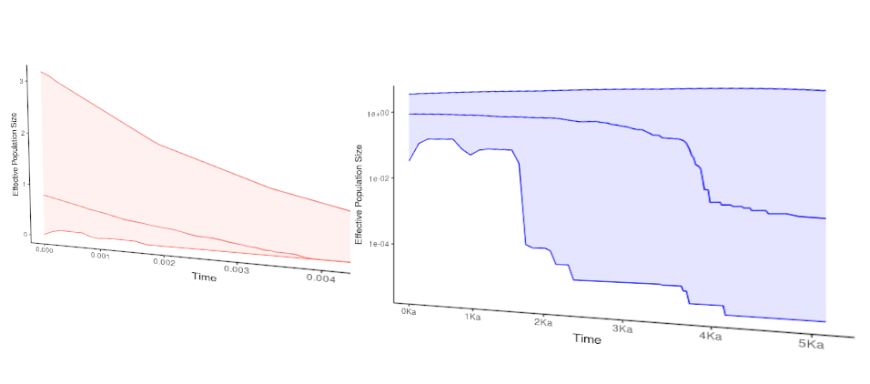

# ggbeast 
## *Plotting BEAST outputs with ggplot2*



## To install the package use:

```{r}
remotes::install_github("wilsonfrantine/ggbeast")
```

## Plotting Extended Bayesian Skyline Plots

You can just run the lines bellow, changing the words between quotes by the file path for your EBSP results.

```{r}
library("ggbeast")

p1 <- ggebsp("path_to_your_EBSP_run_log_file")

p1

```
## Customizing it

As any other ggplot2 object, you can customize it wherever you want.
To see how to change specificities as colors, time scales, Ne scales and how to plot many ebsp runs, please take a look on [this vignette](vignette/using_ggbeast.html)

or open from your R.

```{r}
vignette("using_ggbeast")
```

Have fun!

If you get any crash, please get in touch: wilsonfrantine@gmail.com

## References and Credits

This package is highly based on the code writen by Joseph Heled and Tim Vaughan in [Extended Bayesian Skyline Plot tutorial for BEAST 2 Joseph Heled (updated for BEAST 2 by Tim Vaughan)](https://www.beast2.org/tutorials/)

### For more information, take a look at these papers:

[Remco Bouckaert, Joseph Heled, Denise K¨uhnert, Tim Vaughan, Chieh-Hsi Wu, Dong Xie, Marc A. Suchard, Andrew Rambaut, and Alexei J. Drummond. BEAST 2: a software platform for Bayesian evolutionary analysis. PLoS Comput Biol, 10(4): e1003537, Apr 2014. doi: 10.1371/journal.pcbi.1003537.](http://dx.doi.org/10.1371/journal.pcbi.1003537.)

[Joseph Heled and Alexei J. Drummond. Bayesian inference of population size history from multiple loci. BMC Evol Biol, 8:289, 2008. doi: 10.1186/1471-
2148-8-289.](http://dx.doi.org/10.1186/1471-2148-8-289.)

